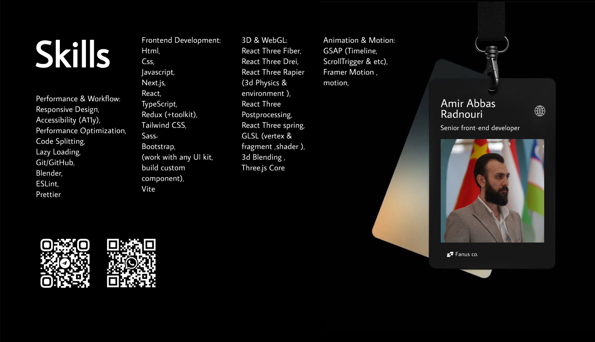
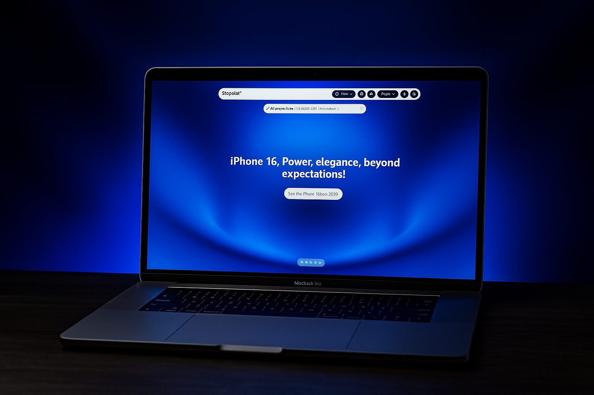
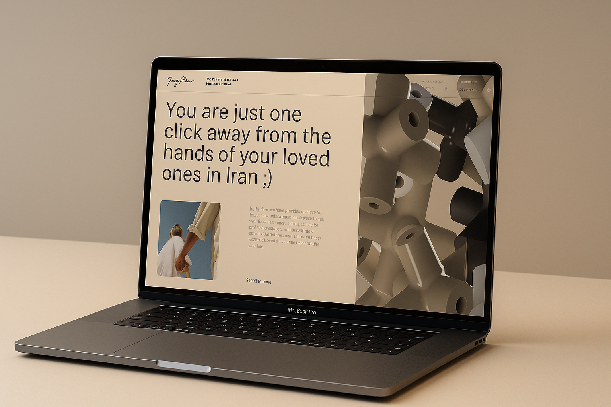
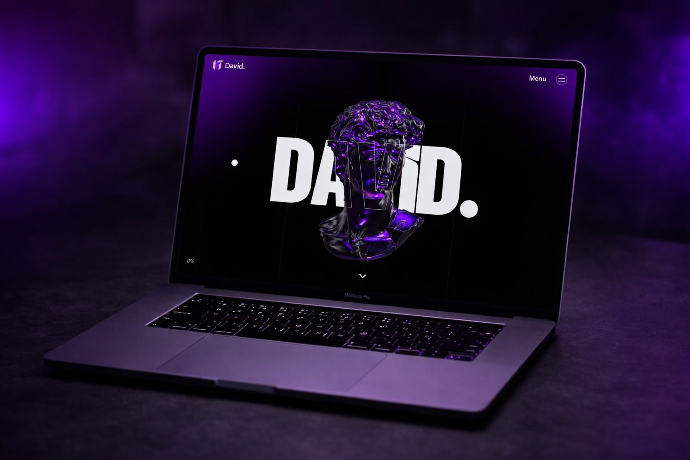

  

 

<b>Selected Projects :</b>

<table width="100%">
<tr>

<td  width="50%">
  
    
  <b>• Shopo</b>
   
  
  A complete, optimized, minimal, animated & multi-purpose store with 3D product display and customization.
 
    
  
  
</td>
</tr>
  <tr>
<td  width="50%">
  
    
  <b>• JoyPlus</b>
   
  
Beta version of the event service ( Interactive 2D and 3D animations ).
 
    
  
</td>
</tr>
  <tr>
<td  width="50%">
  
    
  <b>• David</b>
   
  
R3F (Three.js,Webgl) example.
  
    
  
</td>

</tr>
</table>

